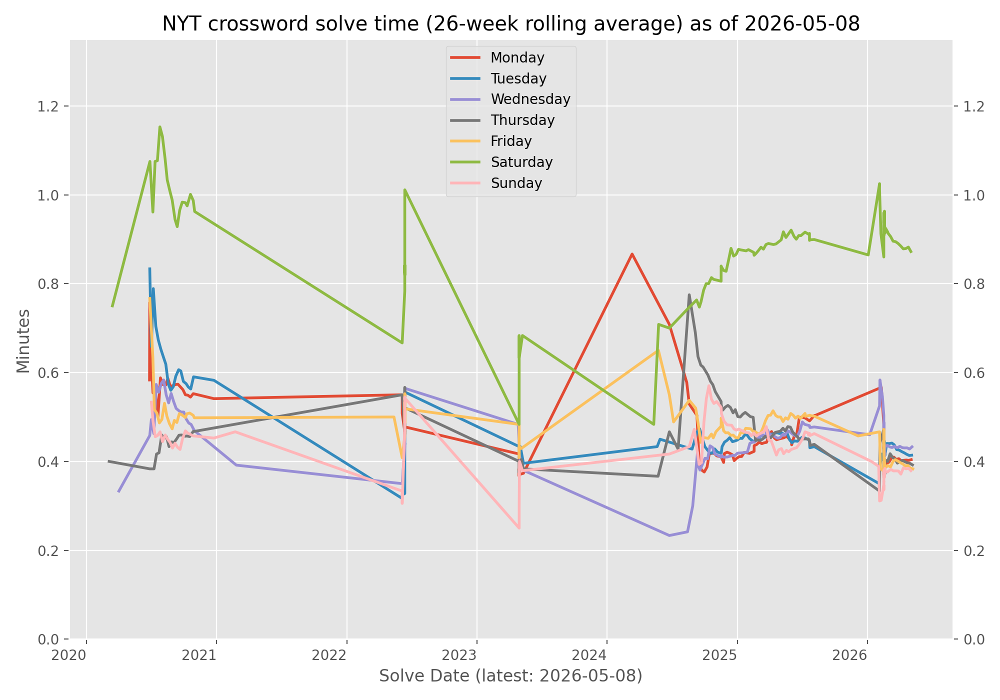

# NYT Midi Crossword Stats

A personal tracker for my [NYT Midi Crossword](https://www.nytimes.com/crosswords/game/midi) solve times.

A Rust binary scrapes solve history from the NYT API and writes it to a CSV file. A Python script then reads the CSV and generates a rolling-average trend chart, which is committed back to this repo daily via GitHub Actions.

<!-- last-run:start -->
**Last updated:** 2026-05-08 at 23:10 UTC
<!-- last-run:end -->

<!-- latest-solve:start -->
**Most recent solve:** 2026-05-08 (Fri) — 20s
<!-- latest-solve:end -->

<!-- crossword-graph:start -->
## NYT Crossword Times



_Updated daily by GitHub Actions._
<!-- crossword-graph:end -->

## How It Works

1. **Scraper** (`src/`): A Rust binary authenticates with the NYT API using a subscription cookie/header and fetches solve statistics for every puzzle since a configurable start date. Results are cached in `data.csv` so only new or previously-unsolved puzzles need to be re-fetched on subsequent runs.

2. **Plotter** (`plot/plot.py`): A Python script reads `data.csv`, filters out cheated or revisited puzzles, and plots a 26-week rolling average of solve times broken out by day of week.

3. **Automation** (`.github/workflows/main.yml`): A GitHub Actions workflow runs daily at 10:30 UTC. It runs the scraper, regenerates the graph, updates this README, and commits the changes.

## Setup

### Prerequisites

- Rust toolchain (stable)
- Python 3.12+
- An active NYT subscription

### Running Locally

1. Obtain your NYT session token. It can be found as the `NYT-S` cookie or `nyt-s` request header when logged in to the NYT website in a browser.

2. Run the scraper:

   ```sh
   cargo run --release -- --nyt-cookie <YOUR_NYT_S_COOKIE> --start-date 2020-01-01 data.csv
   ```

3. Install Python dependencies and generate the graph:

   ```sh
   pip install -r plot/requirements.txt
   python plot/plot.py data.csv graph.png
   ```

### GitHub Actions

Set a repository secret named `NYT_S` containing your NYT-S cookie value. The `main.yml` workflow will handle the rest automatically.

